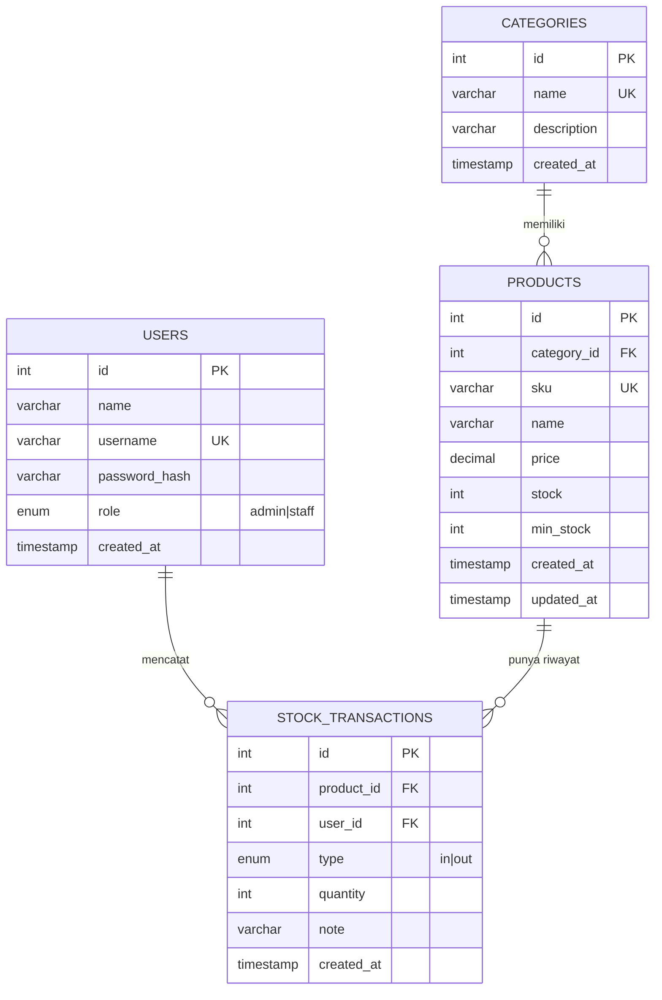

# ERD - Inventory App

```mermaid
erDiagram
    USERS ||--o{ STOCK_TRANSACTIONS : "mencatat"
    CATEGORIES ||--o{ PRODUCTS : "memiliki"
    PRODUCTS ||--o{ STOCK_TRANSACTIONS : "punya riwayat"

    USERS {
        int id PK
        varchar name
        varchar username UK
        varchar password_hash
        enum role "admin|staff"
        timestamp created_at
    }
    CATEGORIES {
        int id PK
        varchar name UK
        varchar description
        timestamp created_at
    }
    PRODUCTS {
        int id PK
        int category_id FK
        varchar sku UK
        varchar name
        decimal price
        int stock
        int min_stock
        timestamp created_at
        timestamp updated_at
    }
    STOCK_TRANSACTIONS {
        int id PK
        int product_id FK
        int user_id FK
        enum type "in|out"
        int quantity
        varchar note
        timestamp created_at
    }
```

Relasi: 1 kategori → banyak produk; 1 produk → banyak transaksi stok; 1 user → banyak transaksi stok.
Semua FK memakai `ON DELETE RESTRICT` agar data historis tidak hilang.
